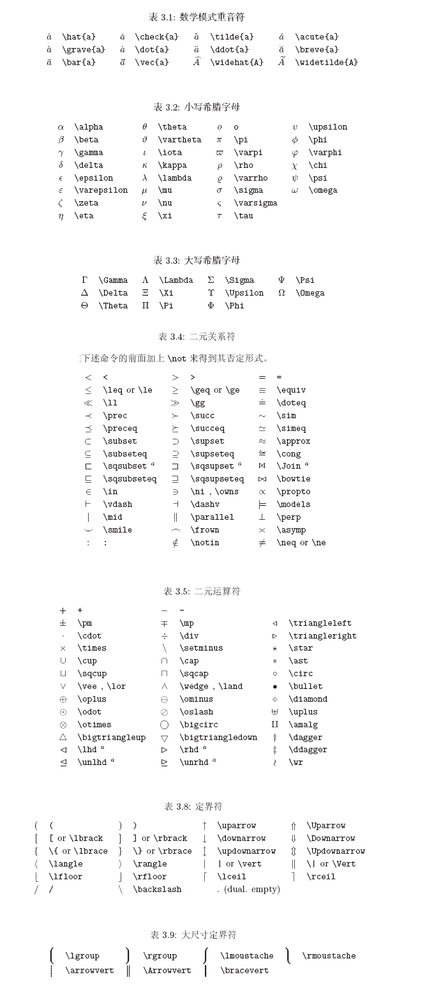
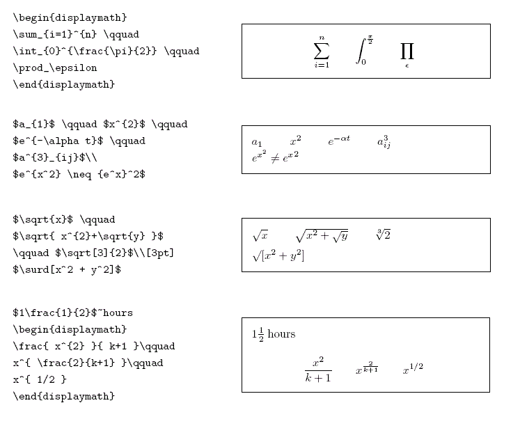

# 其他

## 支持的 HTML 元素

不在 Markdown 涵盖范围之内的标签，都可以直接在文档里面用 HTML 撰写。

目前支持的 HTML 元素有：kbd b i em sup sub br等 ，如：

## 数学公式

用两个**\$\$**包裹

语法：

```markdown
$$
z = \frac{x}{y}
$$
```

效果：
$$
z = \frac{x}{y}
$$
### LaTex符号图：



